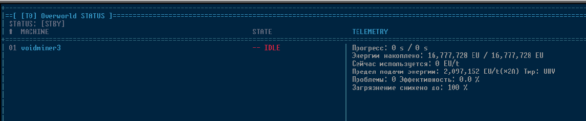
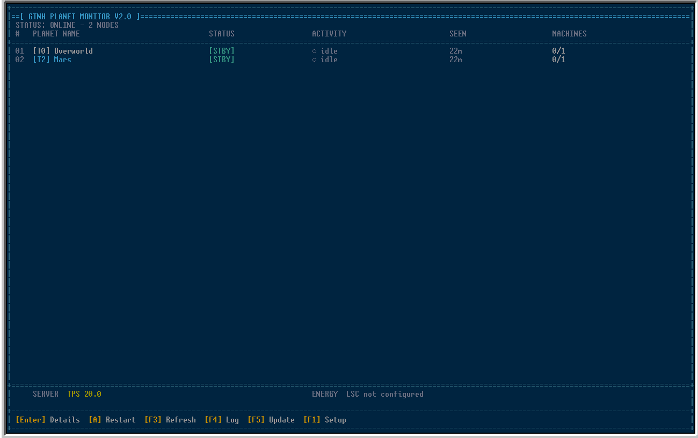
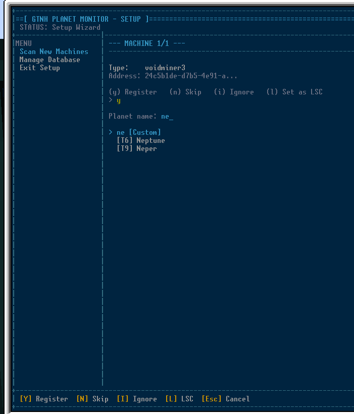
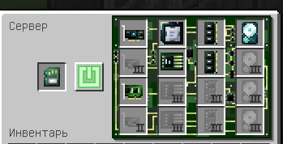

# GTNH Planet Monitor V2.0

Централизованная система мониторинга мультиблоков GregTech на удалённых планетах (или в пределах одной базы) через **OpenComputers**.
Система работает напрямую с компонентами `gt_machine` по сети, без необходимости ставить отдельные компьютеры на каждой планете.

## Возможности
- Мониторинг статуса машин в реальном времени (OK, STBY, PROB).
- Отображение активности машин (ACTIVE/INACTIVE), прогресса и проблем.
- Удаленный перезапуск контроллеров (Restart (Enter))
- Удаленное включение/выключение "(T) Toggle" машины
- Группировка машин по планетам в удобном интерфейсе.
- Логирование всех событий (сбои, перезапуски).
- Отображение заряда LSC (Лапотронного суперкристалла) и TPS сервера.




## Структура файлов
```
/home/
├── hub/
│   ├── main.lua          — Главный цикл программы, интерфейс
│   ├── gui.lua           — Логика отрисовки (разделена на статику и динамику)
│   ├── machines.lua      — Работа с компонентами GT (сканирование, статус, рестарт)
│   ├── registry.lua      — База данных планет и машин
│   ├── logger.lua        — Система логирования с буферизацией
│   ├── stats.lua         — Сбор статистики (TPS, LSC)
│   ├── theme.lua         — Цветовая схема (Solarized Dark) и примитивы
│   └── config.lua        — Конфигурация
├── install_hub.lua       — Скрипт установки
└── update_hub.lua        — Скрипт обновления
```

## Требования к оборудованию
- Серверная стойка с Т3 компьютером.
  
  
  
  Использую такой сет компонентов:
  1: Память 3.5 - 2 шт.  
  2: Процессор T3  
  3: Видеокарта T3  
  4: Жесткий диск T3  
  5: Интернет карта  
  6: Компонентная шина Т3 (Если нужно будет подключить более 16 адаптеров, ставим творческую)
- Монитор T3.
- Адаптеры OpenComputers, подключенные к контроллерам мультиблоков. Адаптеры подключаются с помощью MFU, желательно чтобы к граням адаптера не примыкал никакой другой блок. 


## Установка
Для первой установки выполните в терминале OpenComputers:
```bash
wget -q https://raw.githubusercontent.com/Kwazzi44/GTNH-OC-Planet-Monitor-v2/main/install_hub.lua 
```
Скрипт скачает install_hub.lua
После загрузки выполните:
```bash
install_hub.lua
```

## Настройка
1. Запустите мастер настройки:
   ```bash
   /home/hub/main.lua
   ```
2. Выберите пункт **Scan New Machines**. Скрипт найдет все неподключенные адаптеры `gt_machine`.
3. Для каждой машины:
   - Введите название планеты (можно выбрать из списка подсказок или ввести свою).
   - Введите понятное имя для машины. Или оставьте то имя, которое предложила программа 
4. Вы можете назначить один из адаптеров как LSC для мониторинга энергии.
5. Выйдите из сетапа с помощью меню.

## Управление
В основном интерфейсе (`lua /home/hub/main.lua`):
- `↑ / ↓` — навигация по списку.
- `Enter` — открыть детали планеты / подтвердить.
- `B` — назад / выход в список планет.
- `F4` — открыть лог событий.
- `F3` — принудительный опрос всех машин.
- `A` — перезапустить все выключенные машины на выбранной планете.
- `T` — переключить режим работы машины (Toggle).
- `Q` или `Esc` — выход из программы.

## Обновление
Если вышло обновление скрипта нажмите F5 в главном меню скрипта. 
Скрипт скачает только измененные файлы, не затирая вашу базу данных планет.
